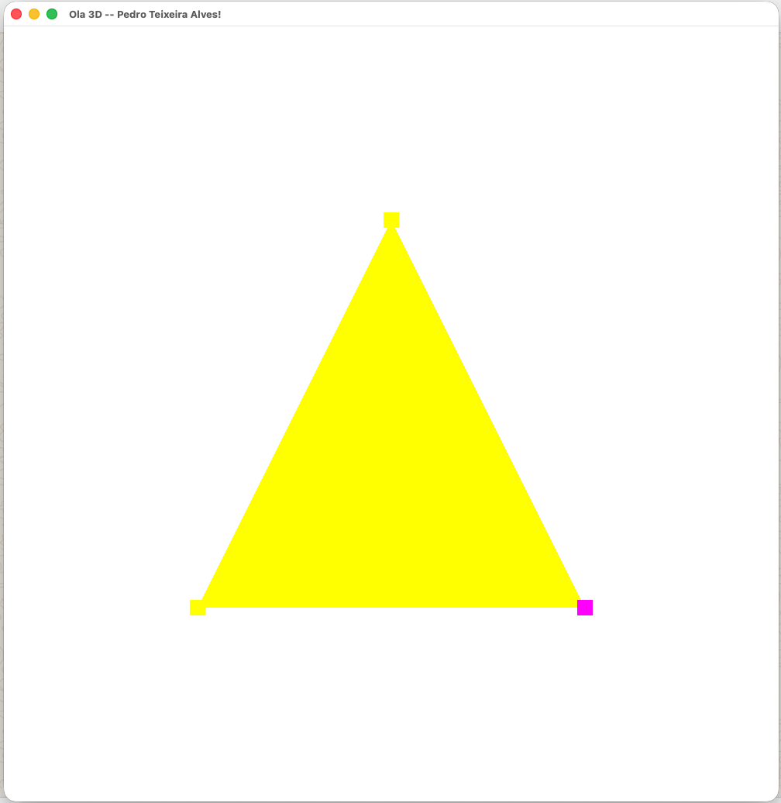

# Hello3D — Resultado

## Mudanças necessárias para rodar no macOS (Apple Silicon)

### 1. Configuração do CMakeLists.txt — GLFW via Homebrew

O GLFW 3.4 compilado via `FetchContent` falha no macOS 26 porque o novo SDK da Apple introduziu sintaxe Objective-C (blocos `^` e atributos Swift) em headers C, quebrando a compilação do código-fonte.

**Solução:** instalar o GLFW via Homebrew e usar `find_package` no lugar do `FetchContent`:

```bash
brew install glfw
```

No `CMakeLists.txt`, substituiu-se:
```cmake
FetchContent_Declare(glfw ...)
FetchContent_MakeAvailable(glfw glm)
```
Por:
```cmake
list(APPEND CMAKE_PREFIX_PATH /opt/homebrew)
FetchContent_MakeAvailable(glm)
find_package(glfw3 REQUIRED)
```

---

### 2. Hello3D.cpp — Contexto OpenGL e versão dos shaders

O macOS cria por padrão um contexto OpenGL 2.1 legado. Além disso, o macOS suporta no máximo **OpenGL 4.1**.

**Hints do GLFW descomentados e ajustados:**
```cpp
glfwWindowHint(GLFW_CONTEXT_VERSION_MAJOR, 4);
glfwWindowHint(GLFW_CONTEXT_VERSION_MINOR, 1);
glfwWindowHint(GLFW_OPENGL_PROFILE, GLFW_OPENGL_CORE_PROFILE);
#ifdef __APPLE__
    glfwWindowHint(GLFW_OPENGL_FORWARD_COMPAT, GL_TRUE);
#endif
```

**Versão dos shaders alterada de `#version 450` para `#version 410`:**
```glsl
#version 410
```

---

## Resultado


